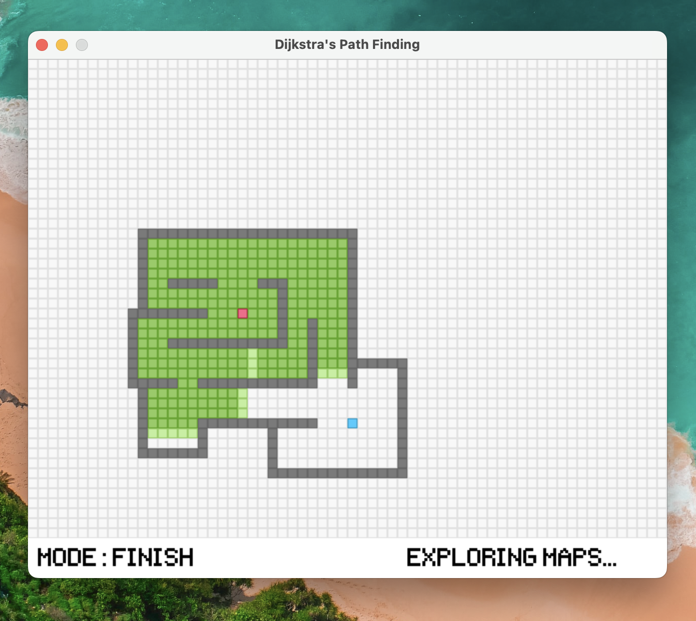
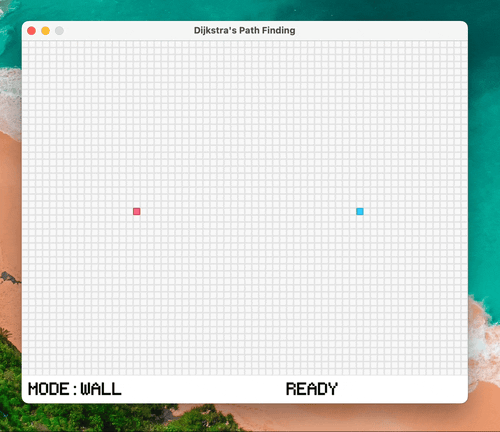

# Djikstra's Shortest Path Visualizer



## About

_Quiz 2 project for Design & Analysis Algorithm IUP 2022 where
we made a shortest path finder in a maze using Djikstra's algorithm_

**Group Members**

- Mikhael Aryasatya Nugraha (5025211062)
- Muhammad Ghifari Taqiuddin (5025211063)
- Riski Ilyas (5025211189)

## Installation

In order to install this, you would first require python (≥ 3.10).
After python has been installed, run the following commands

```
$ git clone https://github.com/riskiilyas/DAA-Dijkstra-Visualizer
$ cd DAA-Dijkstra-Visualizer
$ pip3 install -r requirements.txt
$ python3 main.py
```

If everything done successfully, the program window will open

## Usage



- There are 3 modes when inserting a new tile: starting, finish, and wall tile.
  The current mode is also displayed on the bottom of the screen, along with
  the pathfinding status.
    - Press `1` to insert the starting tile
    - Press `2` to insert the finish tile
    - Press `3` to insert wall

  After pressing the key, you can left-click anywhere in the map to insert a new tile
  and right-click to remove tile

- To start the pathfinding process, press `Enter` key
- After the pathfinding process is done, press `Enter` again
  to restart. This will only erase the path and the visited tile, while
  keeping everything else in the same position
- To reset everything, press `r`. This will erase every tile and place starting
  and finish tile in their initial place
